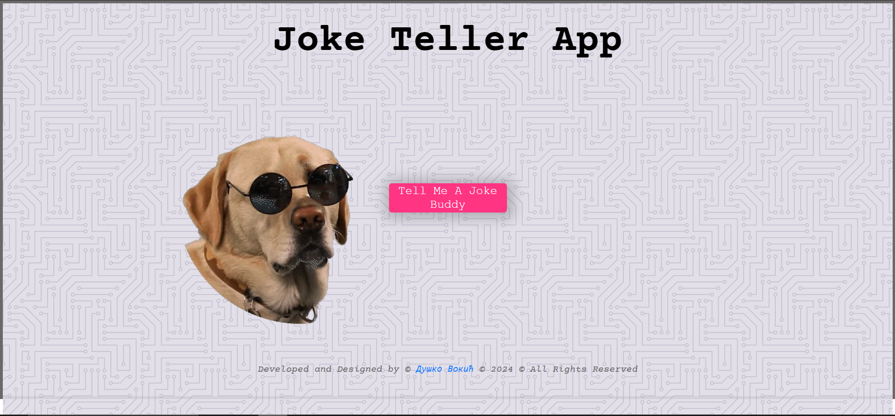

# Joke Teller App

## Joke Teller: Your Source of Chuckles and Giggles


You can check it out [here]( https://d-vokic.github.io/Joke-Teller-App/).

## Author

👤 **Duško Vokić**

* LinkedIn: [Here](https://linkedin.com/in/duško-vokić-0337a2106)
* GitHub: [@D-vokic](https://github.com/D-vokic)

Joke Teller is a web application that delivers doses of humor to users through voice narration of jokes. Users simply click a button, after which the application fetches a joke from the internet and plays it aloud, providing moments of laughter and entertainment.

## Additional Details
1. **User Interaction:** Users can interact with the application by clicking on a designated button to initiate the joke retrieval and narration process.
2. **Variety of Jokes:** The application sources jokes from diverse categories such as programming, miscellaneous, dark humor, puns, and more, catering to a wide range of humor preferences.
3. **Accessibility Features:** The application may include accessibility features such as adjustable playback speed or text visibility options to accommodate users with different needs.

These additional details aim to provide a comprehensive overview of the features and functionality that users can expect from the "Joke Teller" application.

### Overview
Joke Teller is a web application designed to bring laughter and amusement to users by narrating jokes aloud. With a simple click of a button, users can enjoy a variety of jokes sourced from different categories such as programming, miscellaneous, and dark humor. The application leverages a voice narration engine to deliver jokes in an engaging and entertaining manner. Users can interact with the application through an intuitive interface, making it easy to access humor whenever they need a laugh.

### Key Features
1. **Joke Fetching:** The application fetches jokes from various categories such as programming, miscellaneous, dark humor, puns, and more.
2. **Voice Narration:** Utilizes a voice narration engine to read the fetched jokes aloud, providing an engaging and entertaining experience for users.
3. **User Interaction:** Users can interact with the application through a simple and intuitive interface, typically by clicking a button to initiate the joke fetching and narration process.

These key features collectively contribute to the fun and enjoyable experience provided by the "Joke Teller" application.

### Usage
To use the "Joke Teller" application, follow these simple steps:
1. Clone the repository to your local machine using the following command:
```git clone https://github.com/D-vokic/Joke-Teller-App```
1. Navigate to the project directory:
```cd joke-teller ```
1. Open the index.html file in your preferred web browser.
2. Click on the "Tell Me a Joke" button to initiate the joke retrieval and narration process.
3. Enjoy a dose of humor as the application fetches and narrates jokes from various categories.
4. Repeat the process to hear more jokes and share some laughs!

Feel free to explore the codebase and customize the application to suit your preferences. If you encounter any issues or have suggestions for improvements, please don't hesitate to open an issue or submit a pull request.

### Benefits
1. **Entertainment and Relaxation:** The app provides users with moments of laughter and amusement, serving as a source of entertainment and relaxation during breaks or leisure time.
2. **Stress Relief:** Laughter has been shown to reduce stress levels and improve mood. The application offers users a lighthearted escape from everyday stressors through humorous content.
3. **Community Building:** Users can share jokes with friends and family, fostering connections and creating opportunities for shared laughter and bonding.
4. **Accessibility:** The application can be accessed from any device with an internet connection, allowing users to enjoy jokes anytime, anywhere.
5. **Diverse Content:** With jokes sourced from various categories, the app caters to a wide range of humor preferences, ensuring there's something for everyone to enjoy.
6. **Improves Communication Skills:** Listening to jokes can enhance listening and comprehension skills, especially for language learners or individuals looking to improve their communication abilities.

Overall, the "Joke Teller" application offers numerous benefits, from providing entertainment and stress relief to fostering community engagement and communication skills development.

### Implementation
The application is implemented using HTML, CSS, and JavaScript to enable its functionality within a web browser. Here's a brief overview of the implementation:

1. **Frontend Development:**
> Create a simple HTML structure with a button to trigger joke retrieval.
> Use CSS/SASS for basic styling to make the interface visually appealing.
> Incorporate JavaScript to handle user interactions, fetch jokes from an API, and play them using a text-to-speech engine.
2. **Backend Integration (Optional):**
> If required, set up a backend server to handle API requests and responses.
> Implement server-side logic to fetch jokes from external joke APIs based on user preferences.
3. **Text-to-Speech Integration:**
> Integrate a text-to-speech (TTS) engine or service (e.g., VoiceRSS, ResponsiveVoice) to convert text jokes into spoken audio.
> Configure TTS parameters such as language, voice, and playback options.
4. **API Integration:**
> Utilize joke APIs (e.g., JokeAPI, Official Joke API) to fetch jokes from various categories.
> Parse the JSON response from the API to extract joke content and handle any errors or edge cases.
5. **User Interaction:**
> Implement event listeners to handle button clicks and trigger the joke retrieval process.
> Provide visual feedback to users during the joke retrieval process (e.g., loading spinner, disabled button).
6. **Error Handling:**
> Implement error handling mechanisms to gracefully handle API errors, network issues, and other potential failure scenarios.
> Display informative error messages to users and log errors for troubleshooting purposes.
7. **Testing and Refinement:**
> Test the application across different web browsers and devices to ensure compatibility and responsiveness.
> Gather user feedback and make refinements to improve the user experience and address any usability issues.
8. **Deployment:**
> Deploy the application to a web hosting service (e.g., GitHub Pages, Netlify, Heroku) to make it accessible to users over the internet.

By following these implementation steps, you can create a functional and engaging "Joke Teller" application that brings laughter and entertainment to users worldwide.

### Integration
Integrate the "Joke Teller" application by connecting frontend elements with JavaScript to trigger joke retrieval from a chosen API, and utilize a text-to-speech service to convert fetched jokes into spoken audio for user enjoyment. Ensure smooth coordination between frontend, backend (if applicable), text-to-speech, and joke API components to deliver a seamless and entertaining experience to users.

### Conclusion
In conclusion, integrating the "Joke Teller" application involves orchestrating frontend elements with backend services, leveraging text-to-speech technology, and interfacing with joke APIs to deliver humor to users in an engaging format. With careful integration and attention to user experience, the application can provide moments of laughter and enjoyment for audiences worldwide.

## Technologies and Languages

- HTML5
- CSS3 (Sass)
- JavaScript

## License

This project is licensed under the [MIT License](https://www.mit.edu/~amini/LICENSE.md).

## Contact Information

You can contact me via email: vokic.dusko@gmail.com
